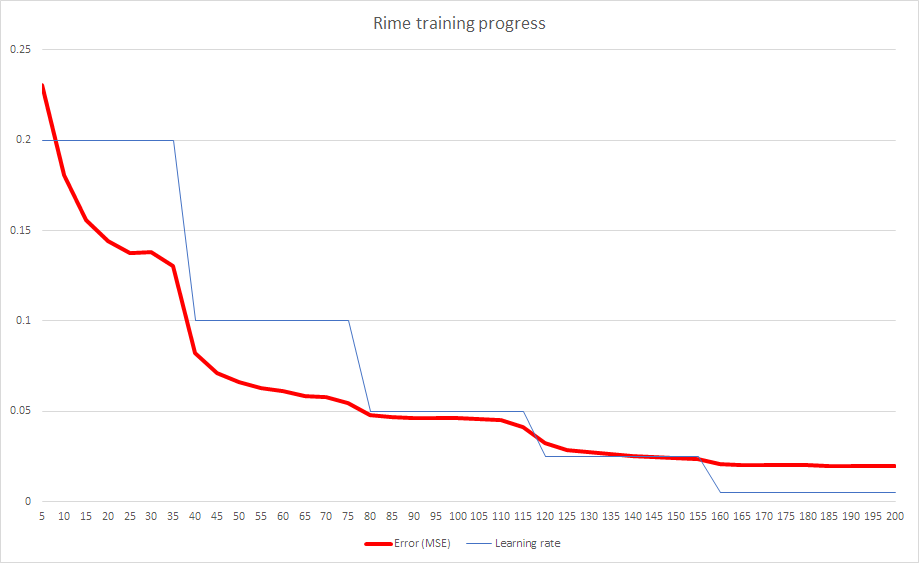

# Rime
Rime is a neural network for categorising a pair of words e.g. ["CAT", "HAT"] as RHYMING or NOT RHYMING.

## Structure
The Rime network is a simple three-layer perceptron.
* **781** input neurons (15 letters x 2 words x 26 letters + 1 bias)
* **20** hidden neurons in 1 layer
* **2** output neurons (rhyming/not rhyming classification)

As such, the network has 15,660 connections.

I wish to experiment using more hidden layers as this may aid the pattern recognition.

## Training
The accuracy on the training data was around **98%** on the last run.



This training and testing was done using thousands of rhyming and non-rhyming word pairs created from the dataset 'rhymelist.txt'.

It's hard to find a set of rhyming words for input. I ended up creating a tiny one myself, by typing up some rhyming words.

## Use
Use of the 'dotheyrhyme' script looks like this:

```
PS D:\code\rime> node dotheyrhyme people steeple

YES - I believe that 'PEOPLE' rhymes with 'STEEPLE'.
```

## Successes
Some of these pairs existed in the training data, and some did not.

```
PS D:\code\rime> node dotheyrhyme rhyme time

YES - I believe that 'RHYME' rhymes with 'TIME'.

PS D:\code\rime> node dotheyrhyme dinner thinner

YES - I believe that 'DINNER' rhymes with 'THINNER'.

PS D:\code\rime> node dotheyrhyme sight site

YES - I believe that 'SIGHT' rhymes with 'SITE'.

PS D:\code\rime> node dotheyrhyme might bite

YES - I believe that 'MIGHT' rhymes with 'BITE'.

PS D:\code\rime> node dotheyrhyme bite boat

NOPE - I think that 'BITE' does not rhyme with 'BOAT'.

PS D:\code\rime> node dotheyrhyme trout throughout

YES - I believe that 'TROUT' rhymes with 'THROUGHOUT'.

PS D:\code\rime> node dotheyrhyme banana ribcage

NOPE - I think that 'BANANA' does not rhyme with 'RIBCAGE'.

PS D:\code\rime> node dotheyrhyme not rhyming

NOPE - I think that 'NOT' does not rhyme with 'RHYMING'.

PS D:\code\rime> node dotheyrhyme frogs legs

NOPE - I think that 'FROGS' does not rhyme with 'LEGS'.

PS D:\code\rime> node dotheyrhyme chinese lanterns

NOPE - I think that 'CHINESE' does not rhyme with 'LANTERNS'.
```

## Failures
Rime was good at memorising pairs from the training set, but didn't appear to very well understand the concept of rhyming.

While there were some pleasant surprises when trying non-training data, there were also plenty of unsuccessful classifications. Among the most embarrassing of these are classifications of clearly non-rhyming word pairs as rhyming word pairs.

```
PS D:\code\rime> node dotheyrhyme range strange

NOPE - I think that 'RANGE' does not rhyme with 'STRANGE'.

PS D:\code\rime> node dotheyrhyme grass brass

NOPE - I think that 'GRASS' does not rhyme with 'BRASS'.

PS D:\code\rime> node dotheyrhyme banana apricot

YES - I believe that 'BANANA' rhymes with 'APRICOT'.

PS D:\code\rime> node dotheyrhyme quite interesting

YES - I believe that 'QUITE' rhymes with 'INTERESTING'.
```

What might help with these issues:
* A larger dataset for training (and testing)
* A deeper network to better pick apart the patterns of rhyming words

## Technology
* Language: JavaScript
* Environment: Node.js
* Libraries: [Synaptic](https://github.com/cazala/synaptic)
* Graph: Microsoft Excel

## Acknowledgements
Neural network built and trained using [Synaptic by Cazala](https://github.com/cazala/synaptic).